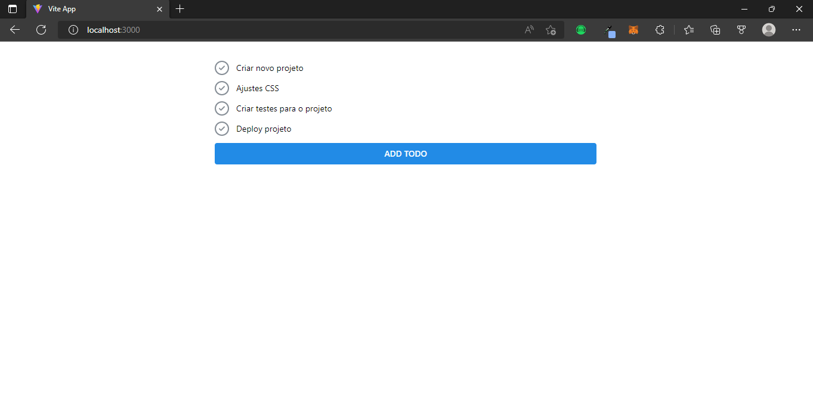
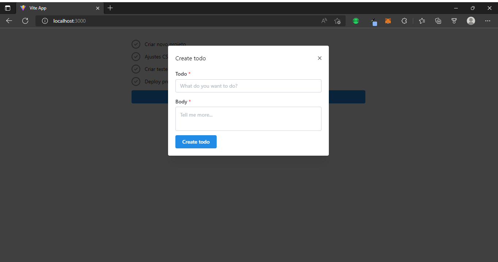

<h1 align="center">
To-Do List em Golang e ReactJS
</h1>

Projeto disciplinar.

## Participantes

[Luciano Ribeiro](https://github.com/lucianorbr)

## Linguagens back-end

- [x] Go

## Linguagens front-end

- [x] HTML
- [x] CSS
- [x] JavaScript

## Frameworks

- [x] Fiber no back-end
- [x] ReactJS no front-end

## O Projeto
- Projeto prático consiste em criação de um To-Do List, onde o backend foi resenvolvido em Go e o Front em JavaScript.

## Como contribuir

- [x] Faça um fork desse repositório;
- [x] Cria uma branch com a sua feature: `git checkout -b minha-feature`;
- [x] Faça commit das suas alterações: `git commit -m 'feat: Minha nova feature'`;
- [x] Faça push para a sua branch: `git push origin minha-feature`.
- [x] Depois que o merge da sua pull request for feito, você pode deletar a sua branch.
- [x] Entre em contato com o desenvolvedor do projeto para que possamos avaliar sua contribuição.
- [x] Agradecemos a sua contribuição!

